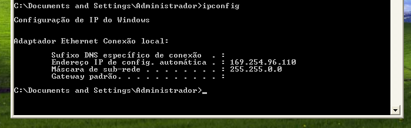

# DHCP

## Instalação
Primeiro: instalar o **Dnsmasq**

$apt install dnsmasq

## Configuração
Primeiro: Configurar o arquivo

$nano /etc/dnsmasq.d/asa.conf

Segundo: Configurar a Interface de redes

$nano /etc/network/interfaces

REINICIAR INTERFACE

$ifdown eth1

$ifup eth1

Terceiro: restart nos serviços

$/etc/init.d/dnsmasq restart

$/etc/init.d/networking restart

## Configuração no Windowns

## Teste

$ipconfig

$ipconfig /all

<Incluir o(s) nome(s) e o conteúdo do(s) arquivo(s) de configuração>

<Distribuir um intervalo (*range* em inglês) de endereços IP; (15 pontos)>
<Reservar 2 endereços (IP fixo) fora do intervalo do item anterior. (5 pontos)>

