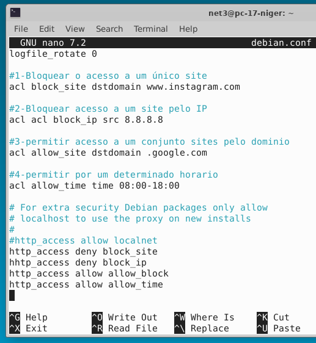
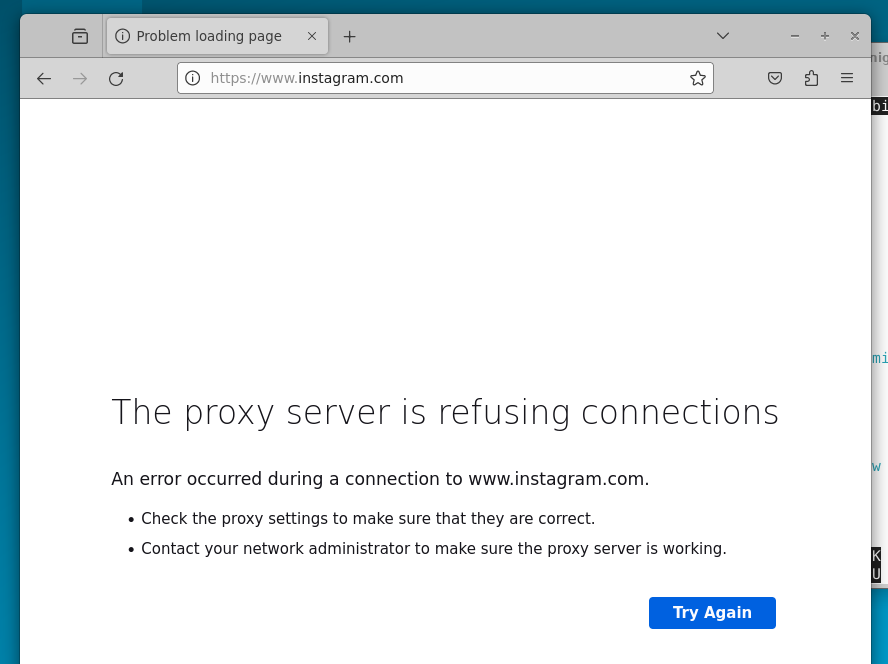
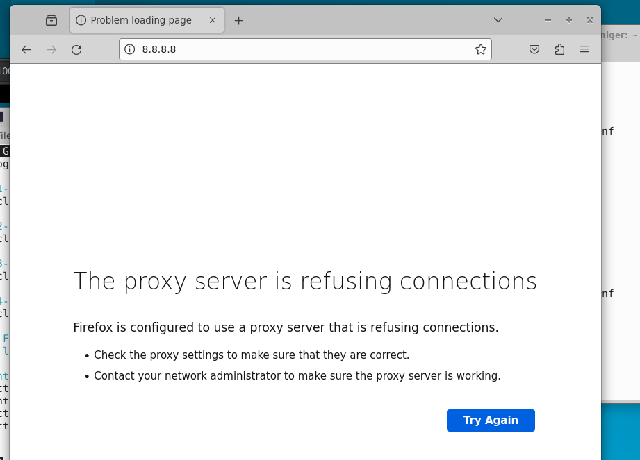
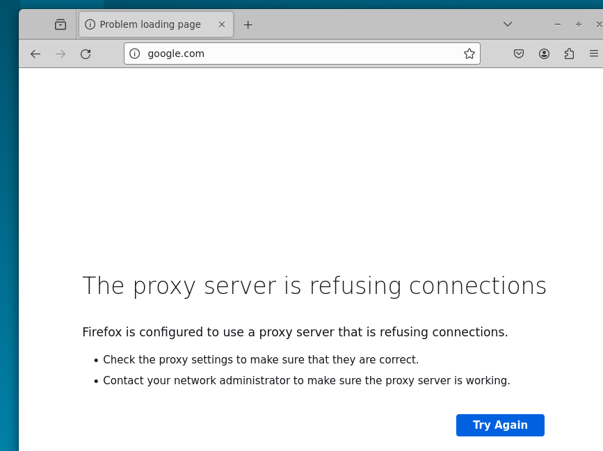

# PROXY
Usando o container da maquina real

$lxc list

$lxc exec pedra bash

## Instalação
Primeiro: Instalar o Squid

$sudo apt install -y squid 

$service squid status

Segundo: criar as acls

$nano /etc/squid/conf.d/

## Configuração

Primeiro: Criar as ACLs

$nano /etc/squid/conf.d/debian.conf

Incluir o(s) nome(s) e o conteúdo do(s) arquivo(s) de configuração.

Fazer a configuração de 4 ACLs distintas, conforme a atividade passada em sala de aula.

## Teste

1 ACL

2 ACL

3 ACL

4 ACL
           
*horario do teste 17:10*

